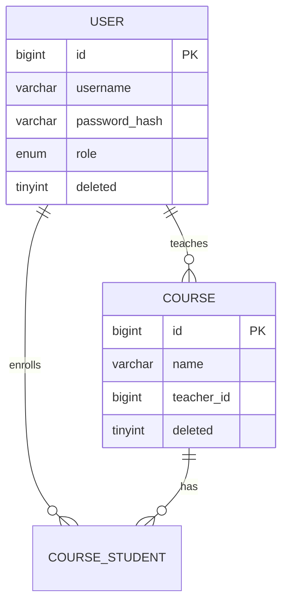

# 数据库设计说明

> **项目**：慧编学伴——智能编程学习助教系统  
> **数据库**：MySQL 8.0  
> **ORM**：SQLAlchemy 2.0 + Alembic  
> **版本**：Phase 0 骨架（表结构随 Phase 1+ 迭代补充）

---

## 1. 命名规范

| 规则 | 说明 | 示例 |
|------|------|------|
| 表名 | snake_case，单数 | `user`、`course`、`chat_message` |
| 字段名 | snake_case | `created_at`、`teacher_id` |
| 索引名 | `idx_{表}_{字段}` | `idx_course_teacher_id` |
| 枚举 | 小写字符串 | `role: student/teacher/admin` |

---

## 2. 公共字段（所有业务表必须包含）

| 字段 | 类型 | 说明 |
|------|------|------|
| `id` | BIGINT UNSIGNED AUTO_INCREMENT | 主键 |
| `created_at` | DATETIME | 创建时间，默认 CURRENT_TIMESTAMP |
| `updated_at` | DATETIME | 更新时间，ON UPDATE CURRENT_TIMESTAMP |
| `deleted` | TINYINT(1) | 逻辑删除：`0` 未删除，`1` 已删除 |

> **软删除策略**：查询默认 `WHERE deleted = 0`；ORM 层统一过滤。

---

## 3. 逻辑外键（skill S7）

**MySQL 不建立物理 FOREIGN KEY 约束。**

关联关系通过以下方式维护：

1. ORM Model 中使用 `relationship()` 描述关联（不生成 FK DDL）
2. 业务层校验引用 ID 存在性
3. 本文档 ER 图标注逻辑外键方向

示例：

```
course.teacher_id  →  user.id（逻辑外键，教师）
course_student.course_id  →  course.id
course_student.user_id  →  user.id
```

---

## 4. 字符集与引擎

- 字符集：`utf8mb4`
- 排序规则：`utf8mb4_unicode_ci`
- 存储引擎：`InnoDB`

---

## 5. 域划分（规划）

| 域 | 表（Phase） | 说明 |
|----|------------|------|
| 用户域 | `user`（Phase 1） | 账号、角色、状态 |
| 课程域 | `course`、`course_student`、`course_teacher`（Phase 1） | 课程与选课 |
| 系统域 | `sys_config`、`operation_log`（Phase 1） | 配置与审计 |
| 资料域 | `course_material`、`material_chunk`（Phase 2） | 知识库 |
| 聊天域 | `chat_session`、`chat_message`、`message_citation`（Phase 2） | AI 对话 |
| 代码域 | `code_submission`、`analysis_result`（Phase 3） | 代码讲解 |
| 学情域 | `knowledge_point`、`learning_event`、`wrong_question_book`、`user_kp_mastery`（Phase 3） | 学习分析 |
| 教师域 | `class`、`assignment`、`ai_answer_audit` 等（Phase 4） | 教学支持 |

---

## 6. ER 图（Phase 0 占位，Phase 1 起补充）



> Phase 1 完成后更新完整 ER 图与字段清单。

---

## 7. Redis 缓存 Key（Phase 2 起，详见 06 路线第十章）

不在 MySQL 存储，见 `docs/deploy.md` 与路线文档 Redis 规范表。

---

## 8. 向量存储（ChromaDB，Phase 2）

- 持久化目录：`./data/chroma`
- Metadata 字段：`course_id`、`chunk_id`、`page`
- 与 `material_chunk` 表通过 `chunk_id` 逻辑关联

---

## 9. 变更记录

| 日期 | Phase | 说明 |
|------|-------|------|
| 2026-06-08 | 0 | 骨架：命名规范、公共字段、逻辑外键说明 |
| — | 1 | 待补充：user/course 等表完整 DDL |
