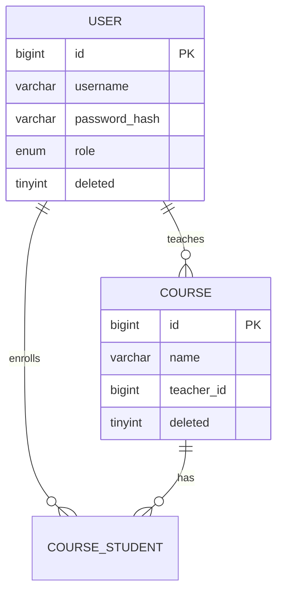

# 数据库设计说明

> **项目**：慧编学伴——智能编程学习助教系统  
> **数据库**：MySQL 8.0  
> **ORM**：SQLAlchemy 2.0 + Alembic  
> **版本**：Phase 0 骨架（表结构随 Phase 1+ 迭代补充）

---

## 1. 命名规范

| 规则 | 说明 | 示例 |
|------|------|------|
| 表名 | snake_case，单数 | `user`、`course`、`chat_message` |
| 字段名 | snake_case | `created_at`、`teacher_id` |
| 索引名 | `idx_{表}_{字段}` | `idx_course_teacher_id` |
| 枚举 | 小写字符串 | `role: student/teacher/admin` |

---

## 2. 公共字段（所有业务表必须包含）

| 字段 | 类型 | 说明 |
|------|------|------|
| `id` | BIGINT UNSIGNED AUTO_INCREMENT | 主键 |
| `created_at` | DATETIME | 创建时间，默认 CURRENT_TIMESTAMP |
| `updated_at` | DATETIME | 更新时间，ON UPDATE CURRENT_TIMESTAMP |
| `deleted` | TINYINT(1) | 逻辑删除：`0` 未删除，`1` 已删除 |

> **软删除策略**：查询默认 `WHERE deleted = 0`；ORM 层统一过滤。

---

## 3. 逻辑外键（skill S7；Phase 3 迁移见 `02_skill.md` §二.7）

**MySQL 不建立物理 FOREIGN KEY 约束。**

关联关系通过以下方式维护：

1. ORM Model 中使用 `relationship()` 描述关联（不生成 FK DDL）
2. 业务层校验引用 ID 存在性
3. 本文档 ER 图标注逻辑外键方向

示例：

```
course.teacher_id  →  user.id（逻辑外键，教师）
course_student.course_id  →  course.id
course_student.user_id  →  user.id
```

---

## 4. 字符集与引擎

- 字符集：`utf8mb4`
- 排序规则：`utf8mb4_unicode_ci`
- 存储引擎：`InnoDB`

---

## 5. 域划分（规划）

| 域 | 表（Phase） | 说明 |
|----|------------|------|
| 用户域 | `user`（Phase 1） | 账号、角色、状态 |
| 课程域 | `course`、`course_student`、`course_teacher`（Phase 1） | 课程与选课 |
| 系统域 | `sys_config`、`operation_log`（Phase 1） | 配置与审计 |
| 资料域 | `course_material`、`material_chunk`、`material_warehouse`（Phase 2+） | 知识库与资料仓库 |
| 聊天域 | `chat_session`、`chat_message`、`message_citation`（Phase 2） | AI 对话 |
| 代码域 | `code_submission`、`analysis_result`（Phase 3 M05） | 代码讲解 |
| 学情域 | `knowledge_point`、`learning_event`、`wrong_question_book`、`user_kp_mastery`（Phase 3 M06） | 学习分析 |
| 教师域 | `class`、`assignment`、`ai_answer_audit` 等（Phase 4） | 教学支持 |

---

## 6. ER 图（Phase 0 占位，Phase 1 起补充）



> Phase 1 完成后更新完整 ER 图与字段清单。

---

## 7. Redis 缓存 Key（Phase 2 起，详见 06 路线第十章）

不在 MySQL 存储，见 `docs/deploy.md` 与路线文档 Redis 规范表。

---

## 8. 资料仓库表（Phase 2 增强）

### material_warehouse

| 字段 | 类型 | 说明 |
|------|------|------|
| name | VARCHAR(64) | 仓库名称 |
| warehouse_kind | ENUM | `file_type` 格式仓 / `course` 课程仓 |
| course_subject | ENUM | 课程仓：`python` / `java` / `cpp` |
| material_type | ENUM | 格式仓：pdf / txt / md / pptx |
| icon, color, sort_order | — | 前端展示与排序 |

逻辑外键：`course_material.warehouse_id` → `material_warehouse.id`；`course_material.uploaded_by` → `user.id`。

---

## 9. 向量存储（ChromaDB，Phase 2）

- 持久化目录：`./data/chroma`
- Metadata 字段：`course_id`、`chunk_id`、`page`
- 与 `material_chunk` 表通过 `chunk_id` 逻辑关联

---

## 10. 代码讲解表（Phase 3）

### code_submission

| 字段 | 类型 | 说明 |
|------|------|------|
| user_id | BIGINT | 逻辑外键 → user.id |
| course_id | BIGINT NULL | 预留；M05 不绑定课程，常为 NULL |
| assignment_id | BIGINT NULL | Phase 4 作业预留 |
| language | ENUM | c / cpp / python / java |
| source_code | TEXT | 源码 |
| version | INT | 同用户全局提交序号 |

### analysis_result

| 字段 | 类型 | 说明 |
|------|------|------|
| submission_id | BIGINT UNIQUE | 逻辑外键 → code_submission.id |
| status | ENUM | pending / running / done / failed |
| result_json | JSON | 结构化讲解（见 M05 Schema） |
| error_message | VARCHAR(512) | 失败原因 |

迁移：`phase5_code_analysis.py`、`phase6_code_optional_course.py`

---

## 11. 学情分析表（Phase 3 M06）

> 详见 `docs/modules/M06_学习分析与推荐.md`。

| 表 | 用途 |
|----|------|
| `knowledge_point` | 课程知识点树（course_id, parent_id, name, sort_order） |
| `learning_event` | 行为埋点（event_type ENUM, payload_json） |
| `wrong_question_book` | 错题本（source_type + ref_id 幂等） |
| `user_kp_mastery` | 用户知识点掌握度（score 0～100） |

迁移：`phase7_learning_analysis.py`；MySQL 冷启动兜底 `ensure_learning_schema()`

---

## 12. 变更记录

| 日期 | Phase | 说明 |
|------|-------|------|
| 2026-06-08 | 0 | 骨架：命名规范、公共字段、逻辑外键说明 |
| — | 1 | 待补充：user/course 等表完整 DDL |
| 2026-06-10 | 2+ | `material_type` / `course_material.type` 扩展 `pptx`；新增 PPTX 演示库 |
| 2026-06-09 | — | 引用 `02_skill.md`：Phase 3 起迁移仅 Alembic，同步更新本文 |
| 2026-06-10 | 3 | 补充 `code_submission`、`analysis_result` |
| 2026-06-10 | 3 | M05 字段同步：course_id 可空、四语言、phase6 |
| 2026-06-10 | 3 | M06 学情四表落地（phase7 + ensure_learning_schema） |
