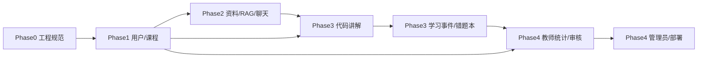

# 06_项目搭建优先级路线（详细路线）

> **项目名称**：慧编学伴——智能编程学习助教系统  
> **编制日期**：2026-06-08  
> **依据文档**：  
> - `root_data/01_慧编学伴——智能编程学习助教系统的设计与实现.pdf`  
> - `out_data/04_Python_功能与技术栈分析总结.md`  
> - `out_data/05_Python_项目查缺补漏与实现审计报告.md`  
> - `root_data/SKILL/01_skill.md`  
> - `root_data/SKILL/02_skill.md`（Phase 3 起阶段规范，2026-06-09）  
> **技术主线**：FastAPI + SQLAlchemy + LangChain + ChromaDB + Vue3  
> **路线目标**：在毕设周期内，按 **P0 → P1 → P2** 顺序可演示、可答辩、可测试验证。

---

## 一、路线使用说明

### 1.1 本文档定位

| 文档 | 作用 |
|------|------|
| **04** | 做什么、用什么技术 |
| **05** | 缺什么、怎么避坑 |
| **06（本文）** | **先做什么、后做什么、做到什么程度算完成** |

### 1.2 与 `01_skill.md` 的强制约束

每条开发任务均须满足以下规范，**不可跳过**：

| 编号 | skill 要求 | 在本路线中的落地方式 |
|------|-----------|---------------------|
| S1 | 基于 Python 开发 | 后端仅使用 `backend/` FastAPI 工程，禁止引入 Java 主服务 |
| S2 | 严格遵循开发说明文档 | 每模块开工前阅读 04/05 对应章节 + 本路线该模块「前置说明文档」 |
| S3 | 生成安全/可靠/测试相关说明文档 | 见 **第七节「文档交付清单」** |
| S4 | 按开发路线优先级 | 未完成 P0 不启动 P1；未完成 P1 不启动 P2 |
| S5 | 完成模块必须测试 | 每模块末尾 **「测试门禁」** 全部通过方可标记完成 |
| S6 | 前端接口设计一致 | 统一遵循 `docs/api-convention.md`（Phase 0 先写） |
| S7 | 逻辑外键 | MySQL **不建物理 FOREIGN KEY**；关系在 ORM 与 `docs/database.md` 说明 |
| S8 | 表/字段命名一致 | 全库 snake_case；公共字段：`id, created_at, updated_at, deleted` |
| S9 | 模块开发前写说明文档 | 见 **2.2 模块开工三部曲** |
| S10 | 模块完成须自测验证 | 见各模块 **「验收标准」** + `docs/testing.md` 记录；Phase 3 起另见 **`02_skill.md` §二.3、§三.2** |

### 1.3 优先级定义

| 级别 | 含义 | 答辩最低要求 |
|------|------|-------------|
| **P0** | 核心闭环，无则无法演示主场景 | **必须全部完成** |
| **P1** | 体现学情与教师价值 | 建议完成 ≥80% |
| **P2** | 增强与扩展，锦上添花 | 时间允许再做 |

### 1.4 模块开工三部曲（skill S9 + S10）

每个功能模块在写代码前、中、后须完成：

```
① 模块说明文档（docs/modules/XX_模块名.md）
      ↓ 评审合理性：业务规则、表结构、API 列表、边界条件
② 编码实现（backend + frontend + 迁移脚本）
      ↓
③ 模块测试 + 自测报告（tests/ + docs/testing.md 追加记录）
      ↓ 验收标准全部勾选
④ 标记模块完成，进入下一优先级模块
```

---

## 二、总体路线鸟瞰

### 2.1 阶段划分（建议 6 周，可压缩为 4 周）

| 阶段 | 周期 | 主题 | 优先级 | 核心交付 |
|------|------|------|--------|---------|
| **Phase 0** | 第 0 周（2～3 天） | 工程与规范奠基 | — | 目录、Docker、规范文档、空工程可运行 |
| **Phase 1** | 第 1 周 | 身份与课程地基 | P0 | 登录、JWT、课程 CRUD、DB 初版迁移 |
| **Phase 2** | 第 2 周 | 知识库 + RAG 问答 | P0 | 资料上传、解析、Chroma、SSE 聊天 |
| **Phase 3** | 第 3 周 | 代码讲解 + 学习档案 | P0 + P1 | 智能讲解、错题本、事件埋点 |
| **Phase 4** | 第 4 周 | 教师端 + 管理 + 部署 | P1 + P2 | 学情图表、审核流、管理员配置、Docker 部署 |
| **Phase 5** | 第 5～6 周（可选） | 增强与答辩打磨 | P2 | 作业模块、Milvus 升级、性能与论文素材 |

### 2.2 核心业务链路打通顺序

必须按以下顺序推进，**后一链路依赖前一链路的数据与接口**：



### 2.3 功能模块与优先级映射

| 模块 | 04/05 编号 | 优先级 | 所在阶段 |
|------|-----------|--------|---------|
| 系统管理（认证/RBAC/配置） | 3.6 / 2.6 | P0 基础 + P1 管理 | Phase 0～1，Phase 4 |
| 课程知识库管理 | 3.3 / 2.3 | **P0** | Phase 2 |
| AI 一对一对话辅导 | 3.2 / 2.2 | **P0** | Phase 2 |
| 智能代码讲解 | 3.1 / 2.1 | **P0** | Phase 3 |
| 学习分析与个性化推荐 | 3.4 / 2.4 | P1 | Phase 3 |
| 教师教学支持 | 3.5 / 2.5 | P1 + P2 审核 | Phase 4 |

---

## 三、Phase 0：工程与规范奠基（第 0 周，2～3 天）

> **目标**：空工程可启动、规范成文、环境一键拉起。  
> **优先级**：全部任务为 **阻塞项**，不完成不进入 Phase 1。

### 3.1 任务清单

| 序号 | 任务 | 产出路径 | 优先级 |
|------|------|---------|--------|
| 0-01 | 创建 monorepo 目录结构（见 04 §4.5） | `backend/`、`frontend/`、`docs/`、`scripts/` | 必须 |
| 0-02 | 编写 `docker-compose.yml` | MySQL 8 + Redis 7 | 必须 |
| 0-03 | 后端：`requirements.txt` + 虚拟环境 | 锁定 04 §七 依赖 | 必须 |
| 0-04 | 后端：`app/main.py` 最小 FastAPI | `GET /health` 返回 200 | 必须 |
| 0-05 | 编写 `backend/.env.example` | DB/Redis/JWT/LLM Key 占位 | 必须 |
| 0-06 | 编写 **`docs/api-convention.md`** | 统一响应体、分页、错误码、SSE 约定 | 必须 |
| 0-07 | 编写 **`docs/database.md`** 骨架 | 命名规范、逻辑外键说明、公共字段 | 必须 |
| 0-08 | 编写 **`docs/testing.md`** 骨架 | pytest 目录约定、Mock 策略 | 必须 |
| 0-09 | 前端：`npm create vue@latest` 初始化 | Vue3 + TS + Router + Pinia + Element Plus | 必须 |
| 0-10 | 前端：Axios 封装 + `.env.development` | `VITE_API_BASE=http://localhost:8000` | 必须 |
| 0-11 | 配置 CORS 白名单 | `app/core/config.py` | 必须 |
| 0-12 | 编写 **`docs/deploy.md`** 骨架 | 本地启动命令、Docker 说明 | 必须 |

### 3.2 `docs/api-convention.md` 必须约定内容

| 项 | 约定值（建议） |
|----|--------------|
| 统一响应 | `{ "code": 0, "message": "ok", "data": T }` |
| 分页请求 | `page_num`（从 1 开始）、`page_size`（默认 10，最大 100） |
| 分页响应 | `{ "list": [], "total": 0, "page_num": 1, "page_size": 10 }` |
| 认证 Header | `Authorization: Bearer <access_token>` |
| 业务错误 | HTTP 200 + `code != 0`，或 HTTP 4xx（二选一，全文统一） |
| 时间格式 | ISO 8601 字符串 `YYYY-MM-DDTHH:mm:ss` |
| ID 类型 | 统一 int64 或 UUID 字符串（全项目一致） |

### 3.3 Phase 0 验收标准

- [ ] `docker compose up -d` 后 MySQL、Redis 可连接  
- [ ] `uvicorn app.main:app --reload` 启动，`/health` 与 `/docs` 可访问  
- [ ] `npm run dev` 前端可打开空白布局页  
- [ ] `docs/` 下 4 份规范文档已创建（api、database、testing、deploy）  
- [ ] 运行 `pytest` 空套件通过（0 failed）

---

## 四、Phase 1：身份与课程地基（第 1 周，P0）

> **目标**：用户能登录、按角色进入不同布局、管理课程与选课关系。  
> **模块说明文档**：`docs/modules/M01_认证与系统管理.md`、`docs/modules/M02_课程与选课.md`

### 4.1 数据库（第 1～2 天）

| 序号 | 表名 | 核心字段 | 逻辑外键 |
|------|------|---------|---------|
| 1-DB-01 | `user` | username, password_hash, role(enum), status, deleted | — |
| 1-DB-02 | `course` | name, description, teacher_id, status, deleted | user.id → teacher_id |
| 1-DB-03 | `course_student` | course_id, user_id, joined_at, deleted | course.id, user.id |
| 1-DB-04 | `course_teacher` | course_id, user_id, deleted | course.id, user.id |
| 1-DB-05 | `sys_config` | config_key, config_value, remark | — |
| 1-DB-06 | `operation_log` | user_id, action, ip, detail, created_at | user.id |

**动作**：

1. SQLAlchemy Model 定义于 `app/models/`  
2. `alembic revision --autogenerate -m "phase1_user_course"`  
3. 更新 `docs/database.md` ER 图（用户域 + 课程域）  
4. `scripts/seed_demo.py`：admin / teacher / student 各 1 个 + 1 门演示课程  

### 4.2 后端 API（第 2～4 天）

| 序号 | 方法 | 路径 | 说明 | 角色 |
|------|------|------|------|------|
| 1-API-01 | POST | `/api/v1/auth/login` | 返回 access + refresh token | 公开 |
| 1-API-02 | POST | `/api/v1/auth/refresh` | 刷新令牌 | 公开 |
| 1-API-03 | POST | `/api/v1/auth/logout` | JWT 黑名单 | 登录用户 |
| 1-API-04 | GET | `/api/v1/auth/me` | 当前用户信息 | 登录用户 |
| 1-API-05 | GET/POST/PUT/DELETE | `/api/v1/courses` | 课程 CRUD | 教师/管理员 |
| 1-API-06 | POST | `/api/v1/courses/{id}/join` | 学生选课 | 学生 |
| 1-API-07 | GET | `/api/v1/courses/my` | 我的课程（按角色） | 登录用户 |

**横切能力（05 §3.1，本阶段必须完成）**：

| 组件 | 路径 | 说明 |
|------|------|------|
| 统一响应 | `app/schemas/response.py` | `ApiResponse[T]` |
| 异常处理 | `app/core/exceptions.py` | 全局 handler |
| JWT | `app/core/security.py` | python-jose + passlib bcrypt |
| 鉴权依赖 | `app/core/deps.py` | `get_current_user`、`require_roles` |
| Redis | `app/core/redis.py` | refresh token、黑名单 |

### 4.3 前端（第 4～5 天）

| 序号 | 路由 | 页面 | 说明 |
|------|------|------|------|
| 1-FE-01 | `/login` | LoginView | 表单 + token 存 Pinia |
| 1-FE-02 | `/register` | RegisterView | 可选，MVP 可仅管理员创建用户 |
| 1-FE-03 | `/student/courses` | StudentCourseList | 学生课程列表 |
| 1-FE-04 | `/teacher/courses` | TeacherCourseList | 教师课程管理 |
| 1-FE-05 | — | Layout 组件 | 按 role 切换侧边栏 |
| 1-FE-06 | — | `router.beforeEach` | 未登录 → `/login`；越权 → 403 页 |

### 4.4 测试门禁（skill S5）

| 测试文件 | 覆盖点 |
|---------|--------|
| `tests/test_auth.py` | 登录成功/密码错误/刷新/登出黑名单 |
| `tests/test_courses.py` | CRUD、学生选课、未授权 403 |
| `tests/test_deps.py` | 角色校验 require_roles |

**自测清单**：

- [ ] 三种角色登录后进入对应菜单  
- [ ] 学生无法访问教师-only 接口（403）  
- [ ] 密码 bcrypt 存储，日志无明文密码  
- [ ] `pytest tests/test_auth.py tests/test_courses.py -v` 全部通过  
- [ ] 在 `docs/testing.md` 记录 Phase 1 测试结果  

### 4.5 Phase 1 完成标志

✅ **用户登录 → 选课 → 看到我的课程列表** 前后端联调通过。

---

## 五、Phase 2：知识库 + RAG 问答（第 2 周，P0）

> **目标**：教师上传 PDF → 自动切片向量化 → 学生基于课程资料 SSE 对话。  
> **模块说明文档**：`docs/modules/M03_课程知识库.md`、`docs/modules/M04_AI对话辅导.md`  
> **依赖**：Phase 1 课程与权限。

### 5.1 数据库与存储（第 1～2 天）

| 序号 | 表/存储 | 说明 |
|------|--------|------|
| 2-DB-01 | `course_material` | course_id, type, file_path, status(enum), version, deleted |
| 2-DB-02 | `material_chunk` | material_id, seq, text, source_page, token_count, deleted |
| 2-DB-03 | `chat_session` | user_id, course_id, title, deleted |
| 2-DB-04 | `chat_message` | session_id, role, content, token_count, deleted |
| 2-DB-05 | `message_citation` | message_id, chunk_id, deleted |
| 2-DB-06 | ChromaDB | 持久化目录 `./data/chroma`；metadata: course_id, chunk_id, page |
| 2-DB-07 | Redis | `material:status:{id}`、`ctx:chat:{sessionId}`、`rate:llm:{userId}` |

**资料状态机（05 B3-01）**：

```
UPLOADED → PARSING → CHUNKING → EMBEDDING → READY
                                    ↘ FAILED（可重试）
```

### 5.2 后端（第 2～5 天）

| 序号 | 组件 | 路径 | 说明 |
|------|------|------|------|
| 2-BE-01 | 文件上传 | `api/v1/materials.py` | 白名单 pdf/txt/md；上限 20MB |
| 2-BE-02 | 解析服务 | `services/document_parser.py` | pdfplumber（MVP 不做 pptx） |
| 2-BE-03 | 切片 | `services/chunking.py` | 512 token 左右 + overlap 50 |
| 2-BE-04 | 向量 | `services/vector_store.py` | Chroma 抽象层 |
| 2-BE-05 | Embedding | `services/embedding.py` | OpenAI 兼容 API |
| 2-BE-06 | RAG | `services/rag.py` | TopK=5 + 引用 chunk_id |
| 2-BE-07 | Celery 任务 | `tasks/material_tasks.py` | parse → chunk → embed |
| 2-BE-08 | LLM | `services/llm_service.py` | LiteLLM 或 LangChain 薄封装 |
| 2-BE-09 | 聊天 API | `api/v1/chat.py` | 会话 CRUD + SSE 流式 |
| 2-BE-10 | Prompt | `prompts/chat_rag.yaml` | system 模板外置 |
| 2-BE-11 | 限流 | `core/rate_limit.py` | Redis 日调用上限 |

| 方法 | 路径 | 说明 |
|------|------|------|
| POST | `/api/v1/materials/upload` | multipart，返回 material_id |
| GET | `/api/v1/materials/{id}/status` | 轮询解析状态 |
| GET | `/api/v1/materials` | 课程资料列表 |
| POST | `/api/v1/chat/sessions` | 新建会话 |
| GET | `/api/v1/chat/sessions` | 会话列表 |
| POST | `/api/v1/chat/sessions/{id}/messages` | SSE 流式问答 |

**业务规则（必须实现）**：

1. `courseId` 必填；学生须已选课；教师须为授课教师  
2. 向量检索无命中 → 返回弱提示「当前课程暂无相关资料」  
3. 禁止 `eval/exec` 用户输入；固定 system prompt 不可被覆盖  
4. 每次 LLM 调用写入 `ai_invoke_log`（Phase 4 建表，本阶段可先 structlog）

### 5.3 前端（第 5～6 天）

| 序号 | 路由 | 说明 |
|------|------|------|
| 2-FE-01 | `/teacher/materials` | 上传 + 进度 + 状态 Tag |
| 2-FE-02 | `/student/chat` | 会话列表 + 聊天气泡 |
| 2-FE-03 | — | SSE 打字效果 + Markdown 渲染 |
| 2-FE-04 | — | 引用卡片「来自第 X 页」 |
| 2-FE-05 | — | 无命中时黄色提示条 |

### 5.4 测试门禁

| 测试文件 | 覆盖点 |
|---------|--------|
| `tests/test_material_pipeline.py` | 上传 → Mock 解析 → 切片数量 |
| `tests/test_vector_store.py` | 写入/检索/按 course_id 隔离 |
| `tests/test_chat_rag.py` | 有/无检索命中；Mock LLM |
| `tests/test_chat_sse.py` | SSE 流式响应格式 |

**自测清单**：

- [ ] 上传演示 PDF 后状态变为 READY  
- [ ] 针对资料内容提问，回答含引用来源  
- [ ] 未选课学生访问该课程 chat → 403  
- [ ] Celery worker 与 Redis broker 正常运行  
- [ ] `pytest tests/test_material_pipeline.py tests/test_chat_rag.py -v` 通过  

### 5.5 Phase 2 完成标志

✅ **教师上传 PDF → 学生选课内 AI 对话（SSE + 引用）** 演示链路打通。

---

## 六、Phase 3：代码讲解 + 学习档案（第 3 周，P0 + P1）

> **目标**：智能代码讲解（至少 Python）；学习事件、错题本、简单推荐。  
> **模块说明文档**：`docs/modules/M05_智能代码讲解.md`、`docs/modules/M06_学习分析与推荐.md`  
> **依赖**：Phase 1 权限；Phase 2 LLM 服务可复用。

### 6.1 智能代码讲解（P0，第 1～3 天）

#### 数据库

| 表名 | 核心字段 |
|------|---------|
| `code_submission` | user_id, course_id, assignment_id(nullable), language, source_code, version, deleted |
| `analysis_result` | submission_id, result_json(JSON), status, deleted |

#### 后端

| 组件 | 说明 |
|------|------|
| `schemas/code_analysis.py` | Pydantic：`AnalysisResult(level, issues[], suggestions[], examples[])` |
| `services/code_analysis.py` | 组装 Prompt → 调用 LLM → 解析 JSON |
| `tasks/code_tasks.py` | 可选 Celery 异步；MVP 可同步 + 超时 60s |
| `api/v1/code.py` | POST 提交、GET 结果、GET 历史 |

**运行级分析策略（05 §2.1）**：

- MVP：**静态 + LLM**，答辩文案写「语义级讲解」  
- 加分项：httpx 调 Judge0 获取 stderr 再喂给 LLM  

#### 前端

| 路由 | 说明 |
|------|------|
| `/student/code` | Monaco 编辑器 + 语言选择 |
| — | Tab：语法 / 语义 / 运行 结果展示 |

#### 测试

- [ ] `tests/test_code_analysis.py`：Mock LLM、Schema 校验、源码超长截断  
- [ ] 未授权 course_id → 403  

### 6.2 学习分析与推荐（P1，第 4～5 天）

#### 数据库

| 表名 | 核心字段 |
|------|---------|
| `knowledge_point` | course_id, parent_id, name, sort_order, deleted |
| `learning_event` | user_id, course_id, event_type, kp_id, payload_json, deleted |
| `wrong_question_book` | user_id, course_id, source_type, ref_id, kp_id, mastered, deleted |
| `user_kp_mastery` | user_id, kp_id, score, updated_at, deleted |

#### 后端

| API | 说明 |
|-----|------|
| POST `/api/v1/learning/events` | 埋点：submit/error/chat/view |
| GET `/api/v1/learning/wrong-book` | 错题本分页 |
| PUT `/api/v1/learning/wrong-book/{id}/mastered` | 标记掌握 |
| GET `/api/v1/learning/recommendations` | 规则：薄弱 KP + 推荐资料 ID |
| `services/mastery.py` | 错题权重 + 时间衰减公式 |

**规则**：统计用 SQL + Python，**不用 LLM 做核心排序**。

#### 前端

| 路由 | 说明 |
|------|------|
| `/student/dashboard` | 学习趋势、薄弱 KP 列表 |
| `/student/wrong-book` | 筛选 + 标记已掌握 |

#### 测试

- [ ] `tests/test_mastery.py`：掌握度公式固定用例  
- [ ] `tests/test_learning_api.py`：推荐仅含已授权课程  

### 6.3 Phase 3 完成标志

- [ ] P0：Python 代码提交 → 结构化讲解 JSON 展示  
- [ ] P1：代码/聊天失败自动进错题本；仪表盘有数据  
- [ ] 相关 pytest 全通过并写入 `docs/testing.md`  

---

## 七、Phase 4：教师端 + 管理 + 部署（第 4 周，P1 + P2）

> **目标**：教师看学情、审 AI；管理员配 Key；Docker 部署可演示。  
> **模块说明文档**：`docs/modules/M07_教师教学支持.md`、`docs/modules/M08_系统运维与部署.md`

### 7.1 班级与作业（P1，第 1～2 天）

| 表名 | 说明 |
|------|------|
| `class` | course_id, name, deleted |
| `class_student` | class_id, user_id, deleted |
| `assignment` | class_id, title, deadline, status, deleted |
| `assignment_submit` | assignment_id, user_id, content, score, deleted |

| API 前缀 | 说明 |
|---------|------|
| `/api/v1/assignments` | 教师布置；学生提交（MVP 可简化） |

### 7.2 教师统计与审核（P1，第 2～4 天）

| 表名 | 说明 |
|------|------|
| `ai_answer_audit` | message_id, status(pending/approved/rejected), reviewer_id, revised_content |
| `class_statistics` | class_id, stat_date, metrics_json（聚合） |
| `ai_invoke_log` | user_id, scene, model, tokens, latency_ms, created_at |

| API | 说明 |
|-----|------|
| GET `/api/v1/teacher/class/{id}/stats` | 错误 TOP、KP 分布 → ECharts |
| GET `/api/v1/teacher/audit` | 待审核列表 |
| PUT `/api/v1/teacher/audit/{id}` | 通过/驳回 |

**审核策略（05 §2.5，MVP 建议）**：

- 全量 AI 回答入审核队列，**默认对学生可见**；驳回后隐藏并通知（答辩可说明为迭代点）  
- 或：高风险场景（含代码答案）必须 approved 后才可见 — 二选一，写入 `M07` 模块说明  

#### 前端

| 路由 | 说明 |
|------|------|
| `/teacher/class/:id/stats` | ECharts 折线/柱状/雷达 |
| `/teacher/audit` | 审核队列对比视图 |
| `/teacher/assignments` | 作业列表（P1 简化版） |

### 7.3 管理员（P1，第 4 天）

| 路由 | API | 说明 |
|------|-----|------|
| `/admin/users` | `/api/v1/admin/users` | 用户 CRUD、角色 |
| `/admin/config` | `/api/v1/admin/config` | AI Key（Fernet 加密）、模型路由、限流配额 |
| `/admin/logs` | `/api/v1/admin/logs` | operation_log 分页 |

### 7.4 部署与运维（P1，第 5 天）

| 任务 | 说明 |
|------|------|
| `/health` | MySQL SELECT 1、Redis PING、Chroma 心跳 |
| `docker-compose.yml` 完善 | 增加 backend、celery-worker、frontend(build) 服务 |
| `docs/deploy.md` 定稿 | 逐步启动命令、演示账号、端口说明 |
| `scripts/backup_db.py` | mysqldump 简易备份 |
| 演示数据 | 1 门课 + 1 份 PDF + 3 段示例对话 + 2 条代码讲解 |

### 7.5 测试门禁

| 测试 | 覆盖 |
|------|------|
| `tests/test_teacher_stats.py` | 聚合 API、隐私（学生不可见他人） |
| `tests/test_admin_config.py` | Key 加密存储 |
| `tests/test_health.py` | 各组件探活 |

### 7.6 Phase 4 完成标志

✅ **Docker Compose 一键启动 → 完整演示脚本走通 → 管理员可改 API Key → 教师可看图表与审核列表**

---

## 八、Phase 5：增强项（第 5～6 周，P2，可选）

> 时间充裕时按下列顺序追加；**不影响答辩最低标准**。

| 序号 | 增强项 | 说明 | 依赖 |
|------|--------|------|------|
| P2-01 | PPT 解析 | python-pptx 接入 Celery 流水线 | Phase 2 |
| P2-02 | Judge0 沙箱 | 真实编译 stderr | Phase 3 |
| P2-03 | Milvus / pgvector | 替换 Chroma，保留 vector_store 接口 | Phase 2 |
| P2-04 | Celery Beat | 每日班级统计聚合 | Phase 4 |
| P2-05 | 切片预览/手动合并 | 教师端资料管理增强 | Phase 2 |
| P2-06 | Ollama 本地 7B | llm_router 增加 local 通道 | Phase 2 |
| P2-07 | Prometheus 指标 | `/metrics` 可选 | Phase 4 |
| P2-08 | 作业完整生命周期 | 迟交、批改、成绩导出 CSV | Phase 4 |

---

## 九、文档交付清单（skill S3）

### 9.1 全局文档（Phase 0 创建，后续迭代）

| 文档 | 路径 | 完成阶段 |
|------|------|---------|
| API 约定 | `docs/api-convention.md` | Phase 0 |
| 数据库设计 | `docs/database.md` | Phase 1 起持续更新 |
| 测试说明 | `docs/testing.md` | 每 Phase 追加 |
| 部署说明 | `docs/deploy.md` | Phase 4 定稿 |
| 依赖锁定 | `docs/dependencies.md` | Phase 0 |
| 环境变量 | `backend/.env.example` | Phase 0 |

### 9.2 模块说明文档（skill S9，开发前必写）

| 编号 | 模块文档 | 对应 Phase |
|------|---------|-----------|
| M01 | `docs/modules/M01_认证与系统管理.md` | Phase 1 |
| M02 | `docs/modules/M02_课程与选课.md` | Phase 1 |
| M03 | `docs/modules/M03_课程知识库.md` | Phase 2 |
| M04 | `docs/modules/M04_AI对话辅导.md` | Phase 2 |
| M05 | `docs/modules/M05_智能代码讲解.md` | Phase 3 |
| M06 | `docs/modules/M06_学习分析与推荐.md` | Phase 3 |
| M07 | `docs/modules/M07_教师教学支持.md` | Phase 4 |
| M08 | `docs/modules/M08_系统运维与部署.md` | Phase 4 |

**每份模块说明文档最低结构**：

1. 业务目标与用例  
2. 业务规则与状态机  
3. 数据库表与逻辑外键  
4. API 列表（对齐 api-convention）  
5. 前端页面与路由  
6. 安全与边界（越权、限流）  
7. 测试用例列表  
8. 验收标准勾选框  

### 9.3 输出到 `out_data` 的报告（已完成）

| 文件 | 状态 |
|------|------|
| `04_Python_功能与技术栈分析总结.md` | ✅ |
| `05_Python_项目查缺补漏与实现审计报告.md` | ✅（2026-06-09 前基线；代码进展见 `20260609_工作流审计文档.md`） |
| `06_项目搭建优先级路线（详细路线）.md` | ✅ 本文 |
| `20260609_工作流审计文档.md` | ✅ Phase 1～2 进度审计 |

### 9.4 Skill 规范索引

| 文件 | 作用 |
|------|------|
| `root_data/SKILL/01_skill.md` | 全阶段通用开发要求（S1～S10） |
| `root_data/SKILL/02_skill.md` | Phase 3 起：基线、闭环、打磨、迁移/端口纠偏 |

---

## 十、Redis Key 与缓存规范（Phase 2 起执行）

| Key | TTL | 写入时机 | 失效策略 |
|-----|-----|---------|---------|
| `refresh:token:{uuid}` | 7d | 登录 | 登出删除 |
| `jwt:blacklist:{jti}` | 至 exp | 登出 | 自动过期 |
| `rate:llm:{userId}` | 1d | 每次 LLM 调用 INCR | 日切重置 |
| `rate:submit:{userId}` | 1h | 代码提交 | — |
| `ctx:chat:{sessionId}` | 2h | 每轮对话 | 会话删除时 DEL |
| `material:status:{id}` | 24h | 状态变更 | READY/FAILED 后保留供查询 |
| `cache:dashboard:{userId}` | 10min | 读仪表盘 | 写 learning_event 后 DEL |
| `cache:class_stats:{classId}` | 15min | 读统计 | 日聚合后 DEL |
| `lock:material:parse:{id}` | 60s | Celery 任务前 | 自动释放 |

---

## 十一、每周检查点（Checkpoint）

### 第 1 周末

| 检查项 | 通过标准 |
|--------|---------|
| 登录三角色 | 演示账号均可登录 |
| 课程 CRUD | 教师创建、学生选课 |
| 迁移脚本 | Alembic upgrade head 无报错 |
| 测试 | Phase 1 pytest 绿 |

### 第 2 周末

| 检查项 | 通过标准 |
|--------|---------|
| PDF 上传解析 | 演示 PDF → READY |
| RAG 对话 | SSE 正常、有引用 |
| 限流 | 超额返回 429 或业务码 |
| Celery | worker 日志无持续失败 |

### 第 3 周末

| 检查项 | 通过标准 |
|--------|---------|
| 代码讲解 | Python 样例返回三级 JSON |
| 错题本 | 提交失败自动写入 |
| 仪表盘 | 至少 1 个图表有数据 |

### 第 4 周末（答辩就绪）

| 检查项 | 通过标准 |
|--------|---------|
| Docker 部署 | 新机器按 deploy 文档可启动 |
| 教师统计 | ECharts 至少 2 种图 |
| 管理员 | 可修改 LLM Key 且不写日志 |
| 文档 | api/database/testing/deploy 四件套齐全 |
| 演示脚本 | 15 分钟演示链路无阻塞 |

---

## 十二、15 分钟答辩演示脚本（建议顺序）

| 步骤 | 角色 | 动作 | 对应 Phase |
|------|------|------|-----------|
| 1 | 管理员 | 展示系统配置与 API Key 已配置 | Phase 4 |
| 2 | 教师 | 登录 → 创建/进入课程 → 上传 PDF → 展示 READY | Phase 2 |
| 3 | 学生 | 选课 → 进入 AI 聊天 → 提问课程相关问题 → 展示引用 | Phase 2 |
| 4 | 学生 | 进入代码讲解 → 提交含错 Python 代码 → 展示分级建议 | Phase 3 |
| 5 | 学生 | 打开错题本 / 仪表盘 → 展示学习记录 | Phase 3 |
| 6 | 教师 | 打开班级学情图表 → 打开审核队列 | Phase 4 |
| 7 | — | 展示 `/docs` Swagger + `/health` 全绿 | Phase 0/4 |

---

## 十三、风险与降级策略

| 风险 | 触发信号 | 降级方案 |
|------|---------|---------|
| LLM API 不稳定 | 超时率 >30% | 切换备用模型；Mock 演示数据 |
| Celery 难配 | worker 起不来 | Phase 2 改同步解析（小 PDF） |
| Chroma 安装失败 | 依赖冲突 | 改 FAISS 文件 + 同 vector_store 接口 |
| 前端进度慢 | 第 2 周无聊天 UI | 先用 Swagger + curl 演示 SSE |
| 时间不足 | 第 4 周中 P1 未完成 | 保 P0 演示脚本；P1 统计用静态 JSON |

---

## 十四、总任务优先级速查表

| 优先级 | 任务摘要 | Phase |
|--------|---------|-------|
| **P0** | 工程规范、登录 JWT、课程选课 | 0～1 |
| **P0** | 资料上传 PDF 解析、Chroma、RAG SSE 聊天 | 2 |
| **P0** | Python 代码智能讲解（结构化 JSON） | 3 |
| **P1** | 学习事件、错题本、规则推荐、学生仪表盘 | 3 |
| **P1** | 教师 ECharts 统计、审核队列 | 4 |
| **P1** | 管理员用户/配置、Docker 部署、health | 4 |
| **P2** | 作业完整流、PPT、Judge0、Milvus、Ollama | 5 |

---

## 十五、下一步行动（立即执行）

按以下顺序启动开发，**今日可做 Phase 0**：

1. [ ] 创建 `backend/`、`frontend/`、`docs/` 目录  
2. [ ] 编写 `docker-compose.yml` 并启动 MySQL、Redis  
3. [ ] 初始化 FastAPI 最小工程 + `docs/api-convention.md`  
4. [ ] 初始化 Vue3 工程 + Axios 封装  
5. [ ] 编写 `docs/modules/M01_认证与系统管理.md`（Phase 1 开工前）  
6. [ ] 进入 Phase 1 数据库设计与 Alembic 初版迁移  

---

## 附录 A：与 04 / 05 报告交叉索引

| 06 路线章节 | 04 参考 | 05 参考 |
|------------|--------|--------|
| Phase 0 工程 | §4.5 目录结构、§七 依赖 | §附录 C 文档 |
| Phase 1 认证 | §3.6 系统管理 | §2.6、§3.1 横切 |
| Phase 2 RAG | §3.2、§3.3 | §2.2、§2.3、§5.3 |
| Phase 3 讲解/学情 | §3.1、§3.4 | §2.1、§2.4 |
| Phase 4 教师/部署 | §3.5、§5.2 MVP | §2.5、§七 4 周路线 |
| Redis 规范 | §4.4 | §5.2 |
| 测试要求 | §八 交付物 | 各模块测试 Gate、§3 |

## 附录 B：模块说明文档模板（复制即用）

```markdown
# M0X_模块名称

## 1. 业务目标
## 2. 用例与角色
## 3. 业务规则与状态机
## 4. 数据库表（逻辑外键）
## 5. API 列表
## 6. 前端页面与路由
## 7. 安全、限流与异常
## 8. 测试用例
## 9. 验收标准
- [ ] ...
## 10. 变更记录
```

---

*本路线为「慧编学伴」Python 版唯一推荐的搭建顺序；开发过程中若与 04/05 冲突，以本路线优先级为准，并回写更新 04/05 的补充说明。*
