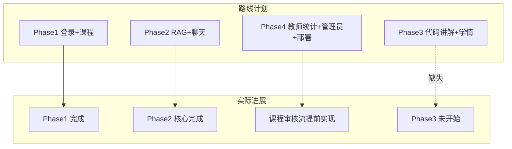

# 20260609_工作流审计文档

> **项目名称**：慧编学伴——智能编程学习助教系统  
> **审计日期**：2026-06-09  
> **依据**：代码库、`docs/` 模块文档、`out_data/06_项目搭建优先级路线（详细路线）.md`、`root_data/SKILL/01_skill.md`、`root_data/SKILL/02_skill.md`  
> **审计范围**：已完成功能、现存问题、路线完整性与偏离、后续规划、需打磨模块、文档完整性

---

## 一、总体进度概览

| 阶段 | 路线目标 | 当前状态 | 完成度（估） |
|------|---------|---------|-------------|
| **Phase 0** 工程奠基 | 目录、Docker、规范文档、空工程可跑 | 基本完成 | ~90% |
| **Phase 1** 身份与课程 | 登录 JWT、课程 CRUD、选课 | 核心完成，并**超前**做了审核流 | ~85% |
| **Phase 2** 知识库 + RAG | PDF 上传、向量检索、SSE 聊天 | 核心链路已打通 | ~75% |
| **Phase 3** 代码讲解 + 学情 | 智能讲解、错题本、仪表盘 | **未开始** | 0% |
| **Phase 4** 教师/管理/部署 | 学情图表、审核、管理员、Docker 全栈 | 仅课程审核部分提前落地 | ~15% |
| **Phase 5** 增强项 | PPT、Judge0、Milvus 等 | 未开始 | 0% |

**当前所处位置**：Phase 2 末段 → 应进入 Phase 3（P0 智能代码讲解），答辩最低闭环还缺 **代码讲解** 这一 P0 模块。

---

## 二、已完成的功能模块

### 2.1 M01 认证与系统管理（Phase 1，P0）

**已实现：**

- 登录 / 刷新 / 登出 / 当前用户（`backend/app/api/v1/auth.py`）
- JWT + Redis 黑名单 + refresh token 轮换
- bcrypt 密码哈希、`require_roles` RBAC
- 前端：`LoginView`、`ForbiddenView`、路由守卫、Pinia 鉴权
- 测试：`test_auth.py`、`test_deps.py`

**部分实现：**

- `sys_config`、`operation_log` 表已建，登录会写 `operation_log`
- **无**管理员配置 API、日志查询 API、用户 CRUD

---

### 2.2 M02 课程与选课（Phase 1，P0 + 部分 Phase 4）

**已实现：**

- 课程 CRUD、我的课程、学生选课/退课
- 学生选课浏览（`/courses/browse` + `StudentCourseBrowse.vue`）
- 搜索、分页、教师姓名展示
- **课程审核流**（超前于路线 Phase 4）：
  - `create_approval` / `publish_approval` / `published_at`
  - 教师申请发布、管理员审核
  - `TeacherCourseList.vue` 管理员审核 UI
- Alembic Phase 1 迁移 + `db_migrate.py` 运行时补列
- 测试：`test_courses.py`（含审核、退课等）

---

### 2.3 M03 课程知识库（Phase 2，P0）

**已实现：**

- 资料上传（pdf/txt/md，大小限制）
- 解析 → 切片 → Embedding → Chroma 向量库
- 状态机：UPLOADED → … → READY / FAILED
- Celery 任务 + `BackgroundTasks` 降级
- Redis 缓存 `material:status:{id}`
- 前端：`TeacherMaterials.vue`（上传 + 轮询状态）
- 测试：`test_material_pipeline.py`、`test_vector_store.py`

---

### 2.4 M04 AI 对话辅导（Phase 2，P0）

**已实现：**

- 会话 CRUD、历史消息、SSE 流式问答
- RAG 检索 + 引用（`message_citation`）
- 无命中弱提示（`no_context`）
- 输入校验、LLM 日限流、structlog 调用日志
- 前端：`StudentChat.vue`（Markdown、引用卡片、推理流展示）
- 测试：`test_chat_rag.py`、`test_chat_sse.py`

---

### 2.5 Phase 0 基础设施

- `docker-compose.yml`（MySQL 8 + Redis 7）
- 规范文档：`api-convention.md`、`database.md`、`testing.md`、`deploy.md`、`dependencies.md`
- FastAPI `/health`、CORS、统一响应体
- Vue3 + TS + Router + Pinia + Element Plus
- 种子脚本：`scripts/seed_demo.py` 等

---

## 三、已实现模块仍存在的问题

### 3.1 M01 认证

| 问题 | 严重度 | 说明 |
|------|--------|------|
| 系统管理能力缺失 | 中 | `sys_config` 仅有表，无读写 API；管理员无法改 LLM Key |
| 操作日志不可查 | 低 | 仅登录写入，无 `/admin/logs` |
| 无用户管理 | 中 | 只能 seed 脚本建账号，无注册/管理员创建用户 |

### 3.2 M02 课程

| 问题 | 严重度 | 说明 |
|------|--------|------|
| 迁移方式双轨 | 中 | Alembic + `ensure_course_schema()` 并存，新环境易混乱 |
| 管理员无专属入口 | 低 | admin 登录进教师页，功能可用但信息架构不清晰 |
| 文档验收未勾选 | 低 | M02 验收标准 `[ ]` 均未标记完成 |
| 审核与选课耦合 | 中 | 学生只能选 `published + create_approval=approved`，演示需先走完审核，流程文档需写清 |

### 3.3 M03 知识库

| 问题 | 严重度 | 说明 |
|------|--------|------|
| 无资料删除/重试 API | 中 | 文档写「FAILED 可重试、软删除同步删向量」，代码未实现 |
| Celery 依赖未文档化 | 中 | 无 worker 时靠 BackgroundTasks，大 PDF 可能阻塞请求线程 |
| `asyncio.run()` 嵌套 | 低 | `process_material` 在 Celery 同步任务里 `asyncio.run(embed_texts)`，某些环境可能有问题 |
| 生产依赖 LLM Key | 高 | Embedding/LLM 需真实 API，无 Key 时 READY 链路失败 |

### 3.4 M04 对话

| 问题 | 严重度 | 说明 |
|------|--------|------|
| `no_context` 判定偏粗 | 低 | 凡 assistant 消息无 citation 均标 no_context，可能误报 |
| 无 Redis 会话上下文缓存 | 低 | 路线规划的 `ctx:chat:{sessionId}` 未做（目前靠 DB 历史） |
| `ai_invoke_log` 未落库 | 低 | 仅 structlog，Phase 4 统计无法对接 |
| 前端端口不一致 | 中 | `.env.development` 为 `8004`，文档为 `8000`/`8002` |

### 3.5 横切问题

| 问题 | 说明 |
|------|------|
| `/health` 过简 | 仅返回 app 状态，未 ping MySQL/Redis/Chroma |
| `README.md` 仍为 Gitee 模板 | 无实际安装/演示说明 |
| 测试环境 | 本机未装 `python-jose`，pytest 未能跑通；`testing.md` Phase 2 记录不完整且有重复行 |
| `out_data/05` 审计报告过时 | 仍写「未发现 backend/frontend」，与现状不符 |

---

## 四、开发路线工作流：完整性与偏离性

### 4.1 工作流完整性（对照 skill + 06 路线 + 02_skill）

| skill/路线要求 | 执行情况 |
|---------------|---------|
| S1 Python 主栈 | ✅ FastAPI 单体，无 Java 主服务 |
| S4 按 P0→P1→P2 | ⚠️ Phase 2 未完成打磨就混入 Phase 4 课程审核 |
| S5 模块完成须测试 | ⚠️ Phase 1/2 有测试文件，但 `testing.md` 曾未完整记录 Phase 2（已修正） |
| S9 开发前写模块文档 | ✅ M01–M04 已有；❌ M05–M08 缺失 |
| S10 完成须自测验证 | ⚠️ 模块文档验收框均未勾选 |
| 02 §二.3 模块闭环三件套 | ⚠️ pytest / 验收勾选 / testing.md 记录均未系统化 |
| 02 §二.7 Alembic 唯一迁移 | ⚠️ 与 `db_migrate.py` 双轨并存 |
| 模块开工三部曲 | Phase 1/2 基本遵循；Phase 3+ 未启动 |

### 4.2 主要偏离

| 偏离项 | 类型 | 评价 |
|--------|------|------|
| 课程审核流提前到 Phase 1/2 | **超前** | 合理，但增加了演示复杂度；应同步更新 M02 与 seed 数据 |
| 无 Phase 3 任何代码 | **滞后** | **最大风险**：P0 答辩链路缺「代码讲解」 |
| 管理员能力仅嵌入教师页 | **简化** | 可接受 MVP，但 `/admin/*` 路线未落地 |
| `db_migrate.py` 替代部分 Alembic | **技术偏离** | 能用，但不利于团队协作与版本追踪 |
| 模块文档放 `docs/modules` 而非 skill 要求的 `out_data` | **轻微** | 已在 `02_skill.md` 澄清：`out_data` 存审计/路线，模块说明存 `docs/modules` |

### 4.3 路线完成度对照

| 06 路线检查点 | 状态 |
|--------------|------|
| 第 1 周末：三角色登录、选课、Phase1 pytest | ✅ 基本达成 |
| 第 2 周末：PDF→READY、RAG+SSE、Celery | ⚠️ 代码有，Celery/联调需环境验证 |
| 第 3 周末：代码讲解、错题本、仪表盘 | ❌ 未开始 |
| 第 4 周末：Docker 全栈、教师图表、管理员 | ❌ 大部分未开始 |

---

## 五、预计之后应做的功能模块（建议顺序）

### 5.1 第一优先级（P0，答辩必需）

1. **M05 智能代码讲解**（Phase 3）
   - 表：`code_submission`、`analysis_result`
   - API：`POST /api/v1/code/submit`、`GET .../result`
   - 前端：`/student/code` + Monaco 编辑器
   - 测试：`test_code_analysis.py`

### 5.2 第二优先级（P1，体现差异化）

2. **M06 学习分析与推荐**（Phase 3）
   - 学习事件埋点、错题本、简单规则推荐
   - 前端：`/student/dashboard`、`/student/wrong-book`

3. **M07 教师教学支持**（Phase 4）
   - 班级学情 ECharts、AI 回答审核队列
   - 可先简化：仅统计 + 审核列表，不做完整作业流

4. **M08 系统运维与部署**（Phase 4）
   - 管理员用户/配置 API
   - `/health` 全组件探活
   - Docker Compose 增加 backend + celery + frontend
   - `deploy.md` 定稿 + 15 分钟演示脚本

### 5.3 第三优先级（P2，时间允许）

- 作业模块、PPT 解析、Judge0 沙箱、资料删除/重试、Milvus 升级

---

## 六、需要打磨的模块

| 模块 | 打磨重点 | 优先级 |
|------|---------|--------|
| **M03 知识库** | 删除/重试 API、Celery 启动说明、失败错误展示 | 高 |
| **M04 对话** | 统一 API 端口、完善 `testing.md` 记录、citation 逻辑 | 高 |
| **M02 课程** | 统一 Alembic 迁移、完善 seed（含已审核已发布演示课） | 中 |
| **M01 认证** | 至少补一个管理员读配置 API（LLM Key） | 中（答辩步骤 1 需要） |
| **Phase 0 文档** | README、deploy 端口统一、health 探活 | 中 |
| **前端** | admin 独立菜单或引导、全局 Loading/错误态 | 低 |

---

## 七、说明文档完整性评估

| 文档 | 状态 | 需补充内容 |
|------|------|-----------|
| `docs/api-convention.md` | ✅ 较完整 | SSE 与 chat 推理流字段可补充 |
| `docs/database.md` | ⚠️ 骨架 | ER 图仍 Phase 0 占位；缺 Phase 2 表 DDL；审核字段未更新 |
| `docs/testing.md` | ⚠️ 过时 | 删除重复 Phase 2 行；补 Phase 2 自测记录；勾选验收 |
| `docs/deploy.md` | ⚠️ 未完成 | 端口矛盾（8000/8002/8004、3306/3307）；缺 Celery/worker 启动；缺生产 Compose |
| `docs/dependencies.md` | ✅ 可用 | 随 Phase 3 增 Monaco 等 |
| `docs/modules/M01–M04` | ⚠️ 有但未闭环 | 验收标准全部 `[ ]`；M02 审核规则已写但未标完成日期 |
| `docs/modules/M05–M08` | ❌ 缺失 | Phase 3/4 开工前必须编写 |
| `README.md` | ❌ 模板 | 项目介绍、快速启动、演示账号、文档索引 |
| `out_data/05_审计报告` | ❌ 过时 | 需做第二轮「代码级审计」更新 |
| `out_data/06_路线` | ✅ 完整 | 可作为后续开发主参考 |

### 7.1 文档建议补充清单（按 urgency）

1. **立即**：更新 `README.md` + 统一 `deploy.md` 端口 + 勾选 M01–M04 验收项
2. **Phase 3 开工前**：新建 `M05_智能代码讲解.md`、`M06_学习分析与推荐.md`
3. **Phase 4 开工前**：新建 `M07`、`M08`；完善 `database.md` ER
4. **答辩前**：重写 `out_data/05` 代码审计；补 15 分钟演示脚本到 `deploy.md`

---

## 八、结论与建议

### 8.1 已完成的核心价值

「登录 → 课程/选课（含审核）→ 教师上传 PDF → 学生 RAG 对话（SSE + 引用）」这条 **Phase 1+2 主链路** 在代码层面已基本具备，测试文件覆盖较全，模块文档 M01–M04 齐全。

### 8.2 最大缺口

Phase 3 **智能代码讲解（P0）** 完全空白，按 06 路线这是答辩演示第 4 步，必须优先开发。

### 8.3 路线偏离评估

课程审核提前实现属于合理增强，但应同步完善 seed 数据与文档，避免演示时「教师建课 → 等审核 → 再发布 → 再选课」步骤过多。

### 8.4 建议下一步（本周）

依据 **`root_data/SKILL/02_skill.md` §四** 执行：

1. 编写 `docs/modules/M05_智能代码讲解.md`
2. 实现 Python 代码提交 + LLM 结构化讲解（Mock 测试先行）
3. 同步更新 `database.md`、`testing.md`、`README.md`
4. 打磨 M03（资料重试）和 deploy 文档，保证联调环境一致

---

## 九、变更记录

| 日期 | 说明 |
|------|------|
| 2026-06-09 | 初版：基于代码库与路线文档的工作流全面审计 |
| 2026-06-09 | 新增 `02_skill.md`；澄清文档索引与 Phase 3 起开发规范 |
