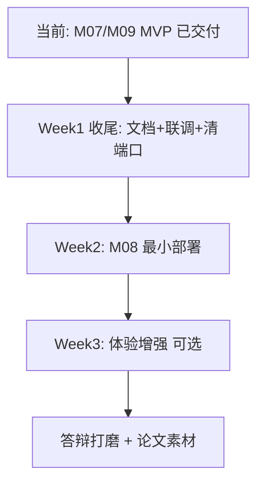

# 后续开发路线与 Bug / 堵塞项解决

> **编制日期**：2026-06-11（Phase 4 首轮更新）  
> **依据**：全量联调（**140 passed**）、`06_项目搭建优先级路线`、M07/M09 交付验收  
> **目标**：明确 Phase 4 剩余工作与**阻塞答辩** vs **可延后**项

---

## 一、本轮联调与修复记录

| 动作 | 结果 |
|------|------|
| `pytest -q` 全量 | ✅ **154 passed** |
| `npm run build` | ✅ 前端生产构建通过 |
| `seed_dashboard_demo.py` | ✅ 已重跑（3 课 / wrong_code=37 / wrong_chat=18 / events=90） |
| `seed_demo.py` | ✅ 基础账号 + 演示课程 |
| M07 教师班级学情 | ✅ API + `TeacherDashboard.vue` + 6 项测试 |
| M09 账户管理 | ✅ 四子模块 + 15 项测试 |
| 登录失败文案 | ✅ 「你的账号或密码错误！」 |
| **8000 端口多进程** | ⚠️ 旧 uvicorn 仍占用 8000，缺少 `/admin/overview`；**8001 为完整后端** |

**当前无 P0 级自动化测试失败。** 前端开发请确认 `VITE_API_BASE` 指向含新路由的后端实例。

---

## 二、Bug / 堵塞项分级

### 🔴 阻塞答辩演示（建议优先处理）

| ID | 问题 | 影响 | 解决方案 | 状态 |
|----|------|------|----------|------|
| **B-00** | M07 教师端缺失 | 教师学情无法演示 | 已交付 MVP | ✅ 已解决 |
| **B-01** | README 阶段描述过时 | 评审误解完成度 | 已更新 README / 本报告 | ✅ 已解决 |
| **B-15** | 8000 旧进程缺 admin 路由 | 管理概览/日志 404 | 结束占用 PID 后单实例重启 8000；或暂用 8001 | ⚠️ 运维待清理 |

### 🟠 影响体验但不阻断演示（答辩前择项）

| ID | 问题 | 影响 | 解决方案 | 状态 |
|----|------|------|----------|------|
| **B-02** | 趋势图近 7 日多为 0 | 折线不好看 | 重跑 `seed_dashboard_demo.py` | ✅ 已解决 |
| **B-03** | 推荐未按 KP 语义匹配资料 | 推荐理由较泛 | `recommendation.py` KP 名模糊匹配 | ❌ 待做 |
| **B-04** | `chat_message` 仅 no_context 进错题本 | 学情不完整 | `chat.py` 全量埋点（可选不进错题本） | ❌ 待做 |
| **B-05** | 仪表盘 Redis 缓存 10min | 切换课程短暂旧数据 | cache key 带 `course_id` 或缩短 TTL | ❌ 待做 |
| **B-06** | 前端 ECharts chunk >1MB | 首屏慢 | 路由级 lazy import | ❌ 待做 |

### 🟢 技术债 / Phase 4+（可写进论文「后续工作」）

| ID | 问题 | 说明 |
|----|------|------|
| **B-07** | FastAPI `on_event` 弃用警告 | 改 `lifespan`（M08 4-09） |
| **B-08** | `ai_invoke_log` 仅 structlog | M08 落库 + Token 统计 |
| **B-09** | Alembic phase4 与仓库字段不一致 | 统一迁移脚本 |
| **B-10** | 历史 `warehouse_id` 空行 | backfill 脚本 |
| **B-11** | `material_view` 未挂钩 | 资料预览写 learning_event |
| **B-12** | AI 教师旁听 / 审核队列 | M07 完整版 |
| **B-13** | Judge0 运行分析 | M05 加分项 |
| **B-14** | OSS 生产存储 | 配置项已有 |

---

## 三、推荐开发路线（Phase 4 剩余）



### 第 1 周：收尾（**当前阶段**）

| 序号 | 任务 | 产出 | 状态 |
|------|------|------|------|
| 4-01～4-05 | M07 教师学情 MVP | 文档/API/前端/测试/seed | ✅ |
| 4-05+ | M09 账户管理子模块 | 四页 + admin API | ✅ |
| 4-05++ | README / 完成度报告 / deploy 更新 | 本文档姊妹篇 | ✅ |
| — | 全量联调 154 passed；个人中心；文档四件套 | ✅ |
| — | 清理 8000 僵尸 uvicorn | 前后端统一 8000 | ⚠️ |

### 第 2 周：部署与配置（M08 最小集）

| 序号 | 任务 | 产出 |
|------|------|------|
| 4-06 | `docker-compose.prod.yml`（api + web + mysql + redis） | 一键演示环境 |
| 4-07 | `docs/deploy.md` 生产章节定稿 | 答辩环境说明 |
| 4-08 | 管理员只读 `GET /admin/config` 或 `.env` 文档化 | 满足「可配置」表述 |
| 4-09 | `lifespan` 替换 `on_event` | 消除 B-07 警告 |

### 第 3 周：体验增强（时间允许）

| 序号 | 任务 | 说明 |
|------|------|------|
| 4-10 | KP-资料语义推荐（B-03） | 提升 M06 推荐可信度 |
| 4-11 | 全量 chat 埋点（B-04） | 近期活动更丰富 |
| 4-12 | 作业模块简化版 | P2，论文扩展章节 |
| 4-13 | AI 审核队列简化版 | 列表 + 通过/驳回 |

### 答辩前检查清单（Checklist）

- [x] 学生：AI 对话能引用资料且 C++/Java/Python 代码语言正确  
- [x] 学生：仪表盘 7 日趋势末位显示「今日」  
- [x] 学生：代码讲解 → 错题本 → 仪表盘链路可走通  
- [x] 教师：班级学情页有真实图表（`/teacher/dashboard`）  
- [x] 管理员：概览 / 学生 / 教师 / 日志 四子模块可演示  
- [x] `pytest` ≥ 120 passed（当前 **140**）  
- [x] `npm run build` 通过  
- [x] `seed_dashboard_demo.py` 已执行且三类课可演示  
- [ ] 前后端统一使用 **8000**（清理旧进程后）  
- [ ] 论文「系统实现」章节与模块完成度表一致  

---

## 四、堵塞项解决 playbook

### 场景 1：演示时趋势图全为 0

1. 确认请求 `days=7`（前端 `TREND_DAYS`）  
2. 执行 `python scripts/seed_dashboard_demo.py`  
3. 若仍为空：在 MySQL 将部分 `wrong_question_book.created_at` 更新为近 7 日  

### 场景 2：管理概览 / 操作日志 404

1. 打开 http://localhost:8000/openapi.json，确认是否含 `/api/v1/admin/overview`  
2. 若无：8000 为旧后端 → 结束占用进程并重启，或改 `VITE_API_BASE=http://localhost:8001`  
3. Windows 查占用：`netstat -ano | findstr :8000`  

### 场景 3：AI 对话错误引用无关资料

- 已上线 `rag_relevance.py` 过滤；确认后端已重启  

### 场景 4：资料长期 PARSING/EMBEDDING

1. 检查 Redis / Celery worker  
2. 教师端「重试」或 `POST .../retry`  

### 场景 5：pytest 本地失败

```bash
cd backend
pip install -r requirements.txt
pytest -q
```

---

## 五、文档同步清单

| 文档 | 状态 | 说明 |
|------|------|------|
| `README.md` | ✅ | Phase 3 + M07/M09；演示 Checklist |
| `docs/testing.md` | ✅ | 140 passed；M07/M09 测试节 |
| `out_data/20260611_功能模块开发完成度报告.md` | ✅ | M07/M09 完成度 |
| `docs/modules/M07_*.md` | ✅ | MVP 验收 |
| `docs/modules/M09_*.md` | ✅ | 子模块拆分 |
| `docs/modules/M08_*.md` | ❌ | M08 开工前编写 |
| `docs/deploy.md` | ✅ | 演示种子 + 端口冲突说明 |

---

## 六、结论与建议

1. **Phase 4 核心演示能力已具备**：教师学情 + 管理员账户管理。  
2. **运维注意**：开发环境需保证单一 uvicorn 实例暴露最新路由。  
3. **下一步建议**：M08 最小部署 → 可选体验增强（B-03/B-04）→ 答辩排练。

**建议开工顺序**：`清理 8000 端口` → `M08 docker-compose.prod` → `deploy 定稿` → `可选推荐/埋点`。
